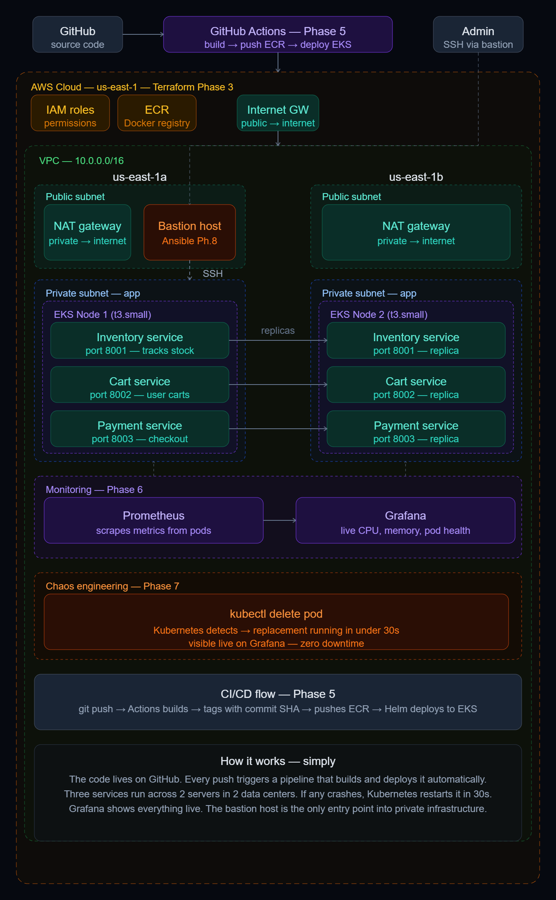
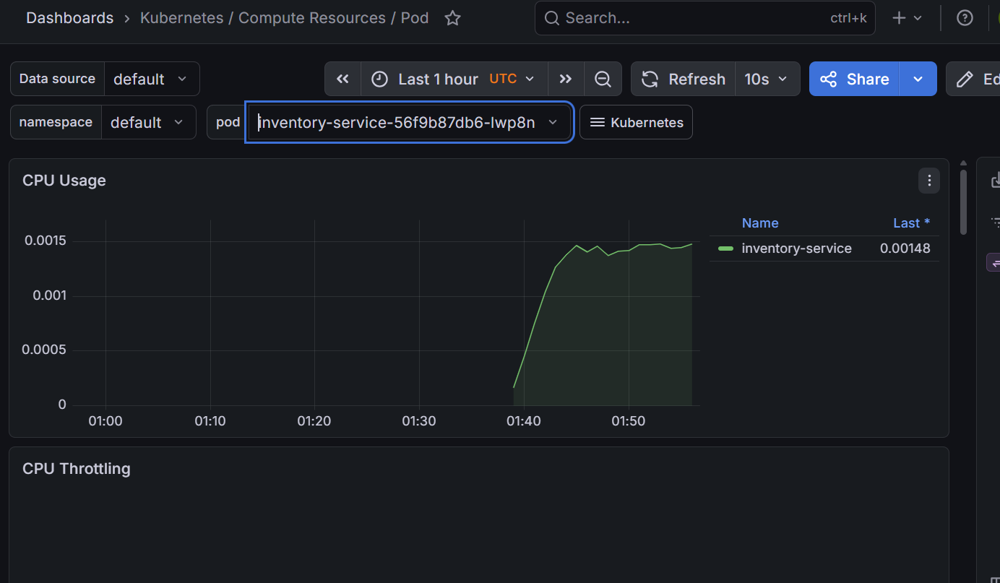
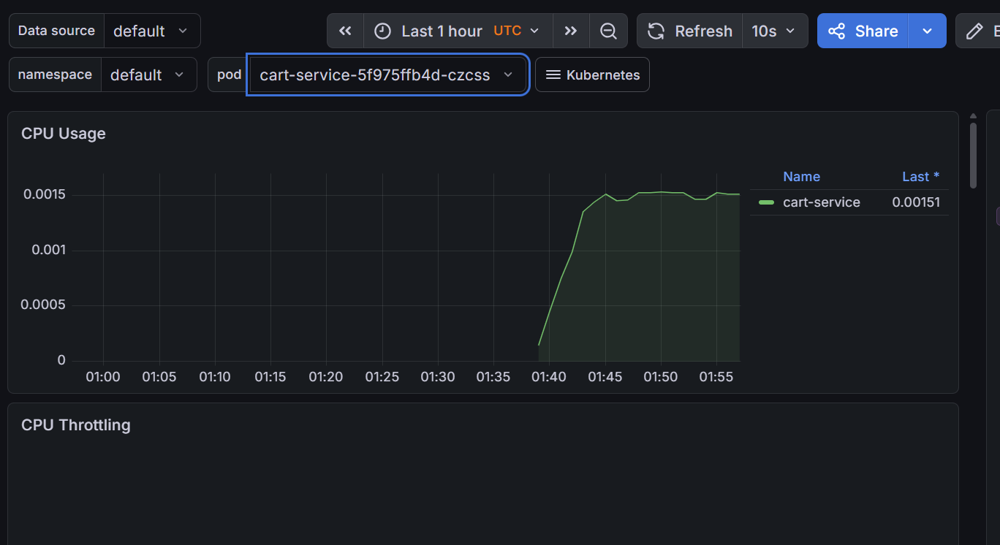
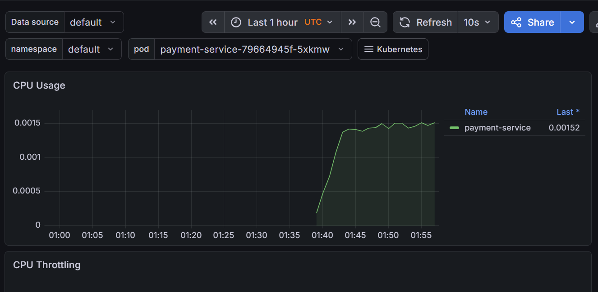
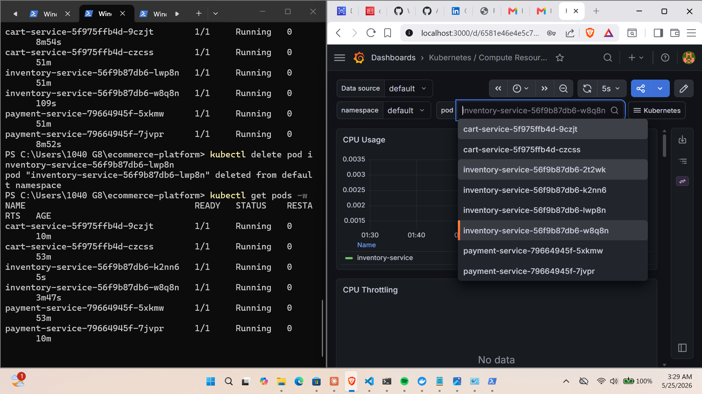
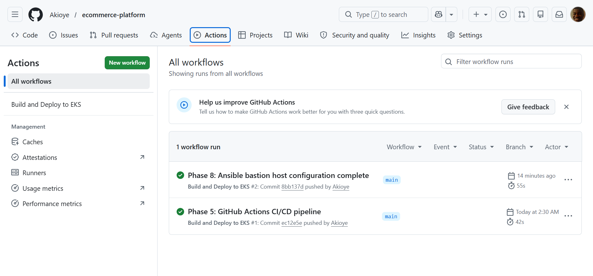
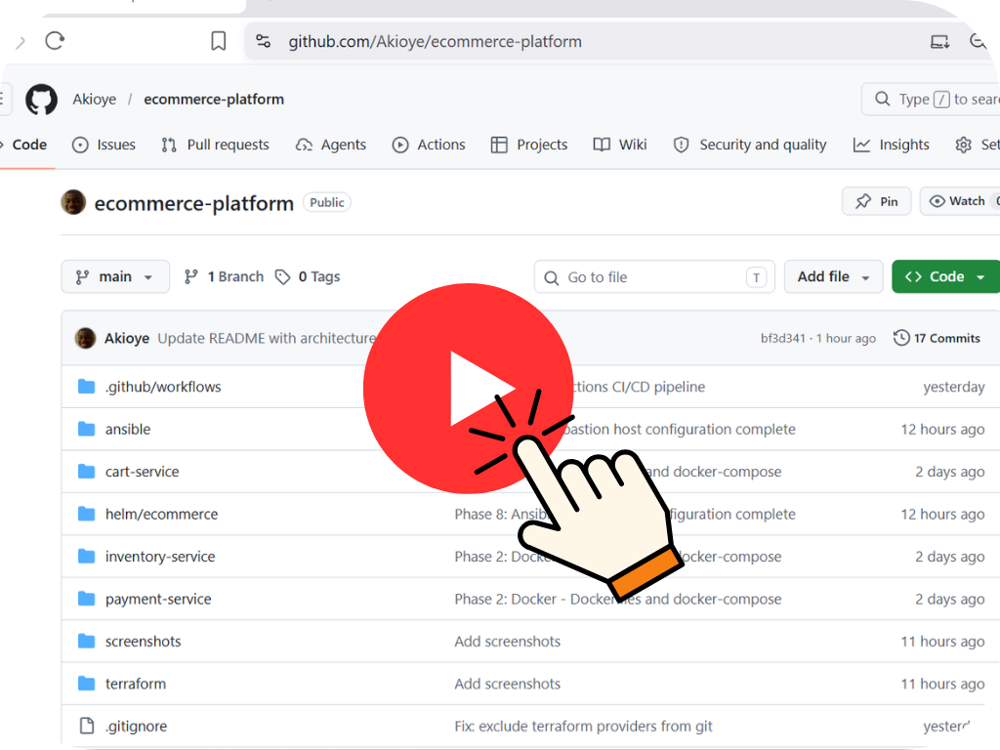

# Self-Healing E-Commerce Platform

A production-grade microservices application with self-healing 
infrastructure on AWS EKS.


## Architecture Diagram
<p align="center">
    
  </a>
</p>


## Tech Stack

- **Python + FastAPI** — microservices framework
- **Docker + Docker Compose** — containerization
- **Terraform** — provisions AWS infrastructure as code
- **AWS EKS** — managed Kubernetes cluster
- **AWS ECR** — private Docker image registry
- **AWS VPC** — private network with public/private subnets across 2 availability zones
- **Helm** — Kubernetes package manager for deployments
- **GitHub Actions** — CI/CD pipeline, auto-deploys on every push to main
- **Prometheus + Grafana** — live monitoring and metrics dashboard
- **Ansible** — bastion host configuration management

## Self-Healing Demo

This platform demonstrates Kubernetes self-healing in real time.

1. All 3 services run with 2 replicas each across 2 availability zones
2. A pod is deliberately deleted using `kubectl delete pod <pod-name>`
3. Kubernetes detects the missing pod within seconds
4. A replacement pod is automatically created and reaches Running status in under 30 seconds
5. The service never goes down — the second replica handles traffic while the replacement starts
6. The entire recovery is visible live on the Grafana dashboard

## Screenshots

### Grafana Live Monitoring
<p align="center">
    
  </a>
</p>

<p align="center">
    
  </a>
</p>

<p align="center">
    
  </a>
</p>


### Chaos Engineering — Pod Self-Healing
<p align="center">
    
  </a>
</p>


### GitHub Actions CI/CD Pipeline
<p align="center">
    
  </a>
</p>


## Demo Video

<p align="center">
  <a href="https://vimeo.com/1195453321?share=copy">
    
  </a>
</p>

## Infrastructure
AWS Infrastructure
│
├── VPC (ecommerce-vpc)
│   ├── Public Subnet 1 (us-east-1a)
│   │   ├── Bastion Host (EC2 t3.micro)
│   │   └── NAT Gateway
│   ├── Public Subnet 2 (us-east-1b)
│   ├── Private Subnet 1 (us-east-1a)
│   │   └── EKS Worker Node 1 (EC2 t3.small)
│   └── Private Subnet 2 (us-east-1b)
│       └── EKS Worker Node 2 (EC2 t3.small)
│
├── Internet Gateway — connects public subnets to internet
├── Route Tables — public and private routing rules
│
├── EKS Cluster (ecommerce-cluster)
│   ├── Control Plane — managed by AWS
│   └── Node Group — 2 worker nodes running your pods
│
├── ECR Repositories
│   ├── inventory-service
│   ├── cart-service
│   └── payment-service
│
└── IAM Roles
    ├── EKS Cluster Role
    └── EKS Node Role

## CI/CD Pipeline

Every push to the main branch automatically:
1. Builds Docker images for all 3 services
2. Tags images with the git commit SHA
3. Pushes images to ECR
4. Deploys to EKS using Helm

## Run Locally With Docker

```bash
git clone https://github.com/Akioye/ecommerce-platform
cd ecommerce-platform
docker compose up --build
```

Services available at:
- Inventory: http://localhost:8001/docs
- Cart: http://localhost:8002/docs
- Payment: http://localhost:8003/docs

## Deploy to AWS

```bash
cd terraform
terraform init
terraform apply
```

Destroy when done:
```bash
terraform destroy
```
